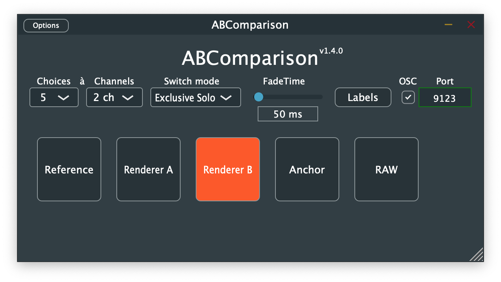

# ABComparisonPlugin
The ABComparison is a simple channel routing plug-in for AB-comparison tests. 

As per default, the plug-in can switch between **10<sup>1</sup> different input streams** with configurable **channel width** (up to 32 channels). **Update:** plug-in now handles up to 32 input streams, however the joke in the footnotes wouldn't work anymore as there are only so many letters in the alphabet...

There are **two switching modes**: the *exclusive solo* mode and *toggle mode*. The first one makes sure that only one choice is playing. 
The **fade-time** can be set to values between 0ms and 1000ms.

**New with version 1.3.0**: The button size and displayed text labels are now customizable! 

**Even newer with version 1.4.0**: OSC Support see [below](#osc-support), thanks to [juhanipaasonen](https://github.com/juhanipaasonen)!

## Download
Compiled VST versions of the ABComparison plug-in for macOS and windows can be downloaded here: 
- macOS: http://danielrudrich.de/plugins/ABComparison_macOS.zip
- windows: http://danielrudrich.de/plugins/ABComparison_win_x64.zip

**Note**: Those files might not be the most current version, better compile them yourself :-)

## Compile the plug-in
To build the ABComparison plug-in you need CMake and a build environment. This repository already comes with the JUCE framework.

I recommend building the plug-in as a VST2 plug-in, the `CMakeLists.txt` is already configured for that. The only thing you need for that is the VST2 SDK. 
```sh
mkdir build
cd build
cmake .. -DCMAKE_BUILD_TYPE=Release -DVST2PATH="/path/to/VST2SDK"
make
```

If you don't have the VST2 SDK or can't get it, you still can build the plug-in as VST3: simply open the `CMakeLists.txt` and replace the `VST` with `VST3` within the `juce_add_plugin` call.
```sh
mkdir build
cd build
cmake .. -DCMAKE_BUILD_TYPE=Release
make
```
## Edit labels and button sizes
Click on the 'labels' button to edit the text on the buttons and their sizes. Separate the individual labels by new lines. If you don't define as many labels as buttons, the remaining buttons will be numbered.

## Usage example: Switch between three 5.1 mixes
 - create a bus with at least 3 * 6 = 18 channels
 - insert the ABComparison plugin
 - route your first 5.1 mix to channels 1 to 6
 - route your second 5.1 mix to channels 7 to 12
 - route your third 5.1 mix to - who would have guessed - channels 13 to 18
 - set number of choices to 3
 - set channel width to 6
 - select one of the coices
 - output will be routed to the first 6 output channels

## OSC support
You can use OSC messages to switch inputs. Per default, the plugin listens to port 9222. You can change the port on the plugin GUI. In the GUI you can also enable or disable receiving OSC messages. The plugin expects messages in form `/switch i`, where i is the index of the input. The indexing starts at 1. So in order to select the third choice -> `/switch 3`. You can also toggle several choices at once, which is usefull in ToggleMode: `/switch 1 3 4`

Made with the [JUCE framework](https://github.com/juce-framework/JUCE)



###### <sup>1</sup> So actually the plug-in should have been named ABCDEFGHIJComparison, however, to make the ABC-pun<sup>2</sup> working, it was named ABComparison
###### <sup>2</sup> You know, you can switch between different options, for instance A, B or C, and C is also the first letter in Comparison. So when you write A, B, and C all capitals, you have actually three choices instead of just A and B.<sup>3</sup>
###### <sup>3</sup> Never explain jokes! Especially when they are that lousy.
